# Time Token and Time Tower

*Product Operation  Component Selection  Physical Iteration and Development Outputs*

This document begins with the final product system. It records how Time Token and Time Tower are intended to work, the preparation and component choices, four physical iterations, and the design outputs produced. Earlier research and concept development are outside the scope of this document.

| Status | Owner | Last updated |
| --- | --- | --- |
| Course prototype development record | [To add: name] | 18 September 2026 |

| Document scope | Included content |
| --- | --- |
| Product | Time Token and Time Tower |
| Development evidence | Quotation, component selection, CAD, STL, firmware, slicing checks, and physical photographs |
| Iteration count | Only stages that were physically printed, assembled, or tested are grouped into the four iterations |
| Evidence boundary | Functions without completed physical verification are clearly marked as intended or pending verification |

## 6  How Time Token and Time Tower Work

Time Token is a personal timing device measuring about 60 × 60 × 60 mm. Time Tower is a shared display about 400 mm tall. Together, they turn an abstract time plan into physical feedback that users can pick up, turn over, view, and accumulate. The Token manages the start, progress, and completion of one time unit. The Tower organises completed units into a vertical record of the day.

Figure 1. Three Time Token lid versions for study, entertainment, and rest.

### 6.1  Intended Time Token Interaction

- The user selects the study, entertainment, or rest Token for the current activity. The three lid icons make each purpose easy to recognise on a desk.

- When the Token is placed in the assigned orientation, the MMA8452Q accelerometer detects its position and starts one time unit.

- The 8 × 8 LED matrix uses a progressive animation to show that timing is in progress. The current firmware uses eight seconds for a quick demonstration. The duration of the final experience should be set by the design rules or a later setting.

- When the time unit is complete, the LED displays a completion animation and the vibration module is intended to provide haptic feedback. The vibration function still requires hardware verification.

- The user synchronises or submits the completed unit to Time Tower, adding the personal time unit to the shared daily record. Data transfer is planned through the ESP32, but the complete communication system has not yet been integrated or verified.

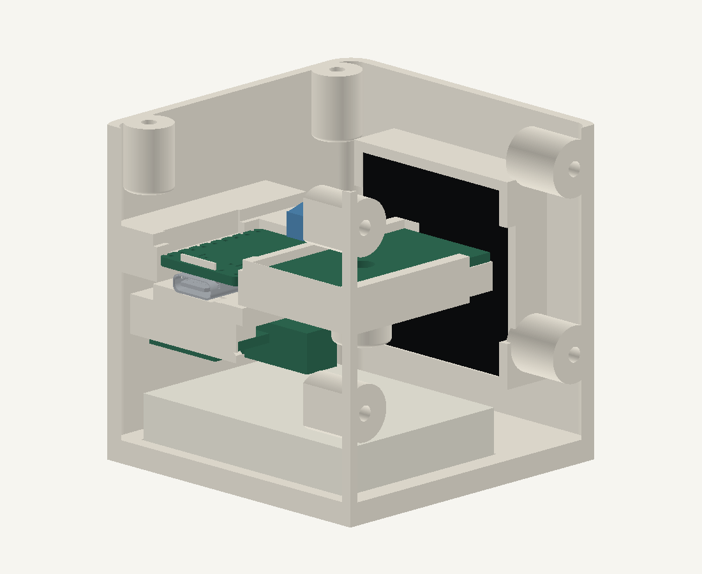

Figure 2. Internal electronic layout of the Token.

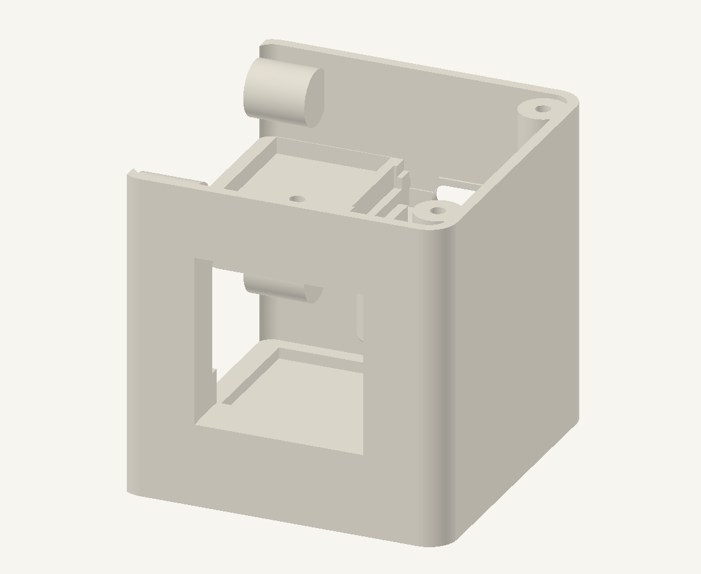

Figure 3. Front LED surround and rear mounting space.

### 6.2  Intended Time Tower Interaction

Time Tower holds an 8 × 32 WS2812B flexible LED panel vertically inside its front window. Each completed time unit enters the display through its colour and position, allowing the distribution of study, entertainment, and rest to be reviewed across the day. The recess at the top holds the Time Token and creates a clear action between the personal device and the shared display. The lower section stores the power bank and control boards, while the upper section supports the display and Token placement.

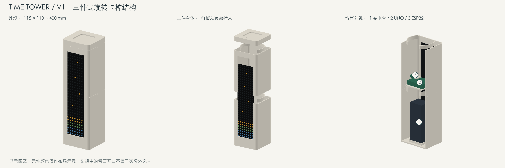

Figure 4. Proposed Time Tower exterior, internal layout, and divided structure.

### 6.3  Function Status and Verification Boundary

| Function | Intended behaviour | Current evidence | Status |
| --- | --- | --- | --- |
| Orientation sensing | Detect the Token orientation and start timing | Serial output reliably reads three-axis data and enters the eight-second timer | Verified separately |
| LED display | Show timing progress and a completion animation | MAX7219 single-pixel scanning and full-panel tests run successfully; complete power stability still needs review | Partially verified |
| Vibration feedback | Provide haptic feedback at completion | GPIO commands output HIGH and LOW, but the purchased module did not vibrate | Not verified |
| Token-to-Tower communication | Submit the activity category and completed unit | Space is reserved for the ESP32 communication board | Intended function |
| Tower time record | Use the 8 × 32 panel to display accumulated results for the day | Structural model, LED rails, and control-board supports are complete | Structure designed |
| Tower top placement | The Token fits into the 62 × 62 mm top recess | CAD interference check passed; final physical fitting photograph is pending | Pending physical confirmation |

### 6.4  Preparation and Quotation

Before modelling began, the project produced a prototype quotation for an interactive LED system containing three Time Tokens and one Time Tower. It recorded the core parts already purchased, an optional independent power solution, and the 3D printing and assembly costs that still needed to be calculated. This shows that component choices, quantities, and budget boundaries were organised before the enclosure was designed.

| Quotation category | Amount (AUD) | Description |
| --- | --- | --- |
| Value of purchased core components | $132.20 | LED matrices, accelerometers, original XIAO controllers, Tower LED panel, and UNO R4 Minima |
| Optional independent power solution | $58.14 | Three sets of LiPo batteries, charging boards, 5 V boost modules, and power switches |
| Known project value | $190.34 | Total value of core components and all optional power components |
| Not yet priced | Pending quotation | 3D printing, wires, headers, solder, heat-shrink tubing, screws, and shipping |

The quotation is dated 9 September 2026. It still lists the Seeed Studio XIAO SAMD21 as the Token controller. The final enclosure was later changed to fit a Waveshare ESP32-S3-Zero for communication capability and compatibility with the available board. The quotation should therefore be treated as evidence of early purchasing and budgeting rather than the final bill of materials.

### 6.5  Power Scope Decision

The early quotation allowed for a LiPo battery, charging board, 5 V boost module, and separate switch in each Token. Adding these parts would significantly increase the Token's size, wiring complexity, and cost. The course prototype only needs to demonstrate the interaction and assembly structure, so the final Token uses external USB power and does not include an internal battery in this version. Time Tower uses a PB200 power bank, and the high LED current should not pass through the UNO R4 Minima.

## 7  Component Selection and Hardware Structure

The commercial components used in the final design are divided between the Token and Tower. They were selected according to size, available stock, programmability, connector direction, and whether they could be held reliably by a 3D printed structure. The following tables distinguish components already placed in the structure from functions that remain planned.

### 7.1  Time Token Components

| Component | Nominal size or specification | Purpose | Mounting method |
| --- | --- | --- | --- |
| Waveshare ESP32-S3-Zero | Board length about 23 mm; USB-C on the underside | Controller, sensor reading, LED control, and future wireless communication | Lowered support platform with an extended retaining bar; USB-C aligned with the rear capsule-shaped opening |
| MMA8452Q accelerometer | 35 × 20 × 7 mm | Detect Token position and orientation | Supported by three cross ribs; M4 × 10 pointed screw with a Ø2.7 mm pilot hole in the plastic |
| MAX7219 8 × 8 LED module | Face about 32 × 32 mm; module and driver about 9 mm thick; transparent cover adds about 1 mm | Display progress and completion animation | Four-sided front surround; pushed outwards from inside; no screws in the confined space |
| 5 V three-pin vibration module | Nominal PCB 23 × 21 mm; rated at 60 mA with about 90 mA starting current | Haptic feedback after completion | Close-fitting rail in the main shell with clearance for the three-pin connector and solder; function not yet verified |
| Mini breadboard | 47 × 35 × 10 mm | Connect and organise prototype wiring | Locating slot about 2 mm deep in the base |

Figure 5. Final internal supports: thin sensor base with cross ribs, lowered ESP32 area, and vibration-module rail below.

### 7.2  Time Tower Components

| Component | Specification | Purpose | Structural position |
| --- | --- | --- | --- |
| WS2812B 8 × 32 RGB LED panel | 316 × 80 × 2 mm, flexible black PCB | Display the vertical time record | Inserted from the top into left and right rails; located by approximately 3 mm blank edges |
| Arduino UNO R4 Minima | Existing development board | Drive the Tower display and overall logic | Removable support platform at the rear of the upper section |
| ESP32-S3-Zero | Compact wireless controller | Planned to receive Token data and pass it to the display logic | Separate support platform at the rear of the upper section |
| CUKTECH 15 PB200 | 20,000 mAh power bank | Provide portable power for the Tower | Placed vertically at the rear of the lower section with ports facing upward |

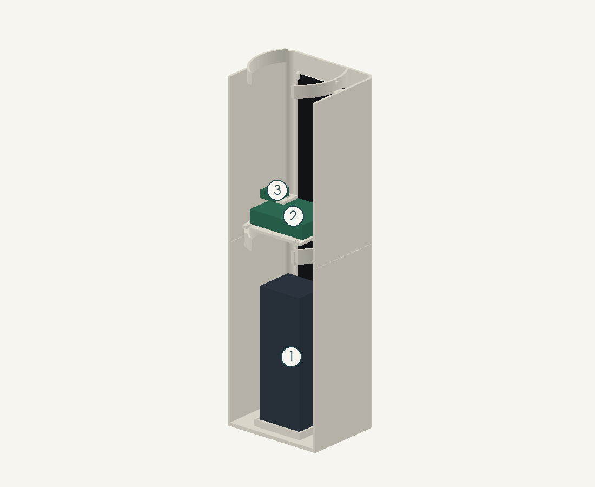

Figure 6. Internal layout of the Tower LED, power bank, and control boards.

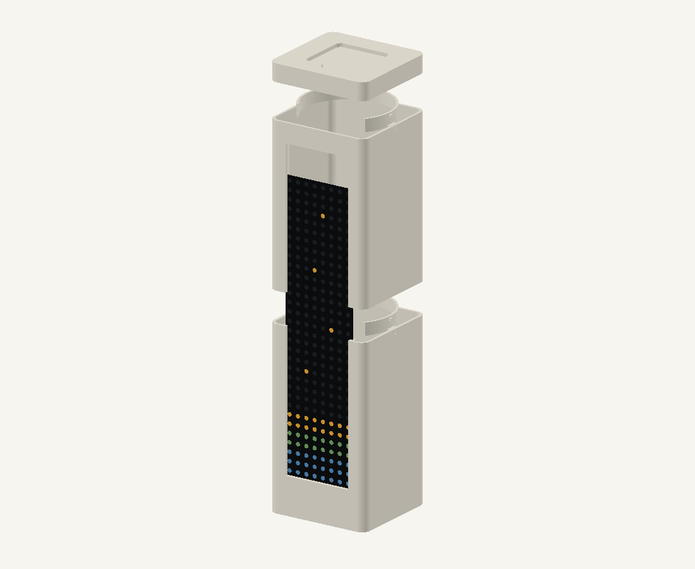

Figure 7. Relationship between the lower section, upper section, and top cap.

## 8  Four Physical Iterations of Time Token

The project files contain CAD subversions from V1 to V11, but these do not represent eleven physical iterations. Based on the making record, the development is grouped into four rounds that involved printing, assembly, or physical fitting. Intermediate CAD versions only show how problems within the same physical round were corrected.

### 8.1  Physical Iteration One  Direct Assembly Around Purchased Components

The first round connected the LED, accelerometer, XIAO controller, and breadboard into a working electronic prototype before building a fixed enclosure around them. The first enclosure measured about 90 × 90 × 80 mm. Its purpose was to confirm component positions and cable paths rather than achieve a portable size. The physical prototype revealed that the jumper wires were long, the LED driver and connectors required more depth, and the upper and lower internal spaces needed to be reorganised.

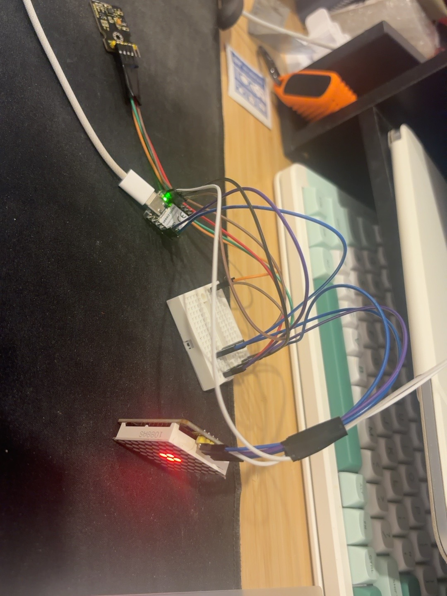

Figure 8. First physical prototype with electronic components directly connected.

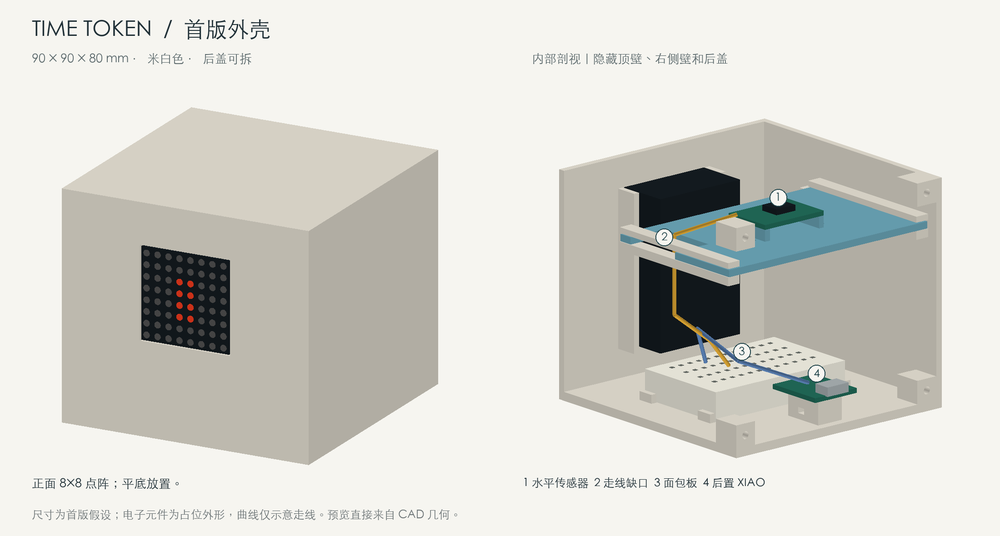

Figure 9. First enclosure and section view built around the original components.

### 8.2  Physical Iteration Two  Reducing the Enclosure to 60 mm and Adding Cable Clearance

The second round reduced the enclosure to about 60 × 60 × 60 mm and changed it to a main shell with an integrated left-and-top cover. The breadboard sat inside a recessed locating slot, while the controller and accelerometer occupied the second level. The first fitting test showed that the jumper connectors above the LED added height and prevented the cover from closing. The LED was therefore lowered, a cable opening was added, and the screw mounts were redesigned for the available M4 × 10 pointed screws.

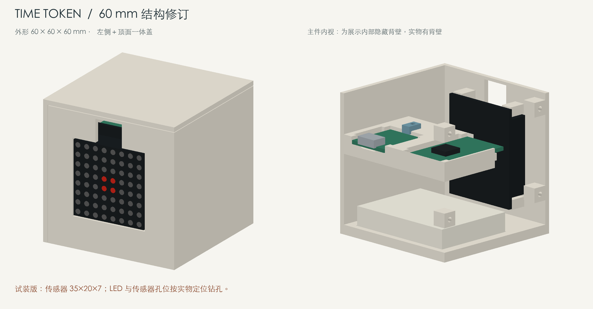

Figure 10. Second-round 60 mm layout and two-level structure.

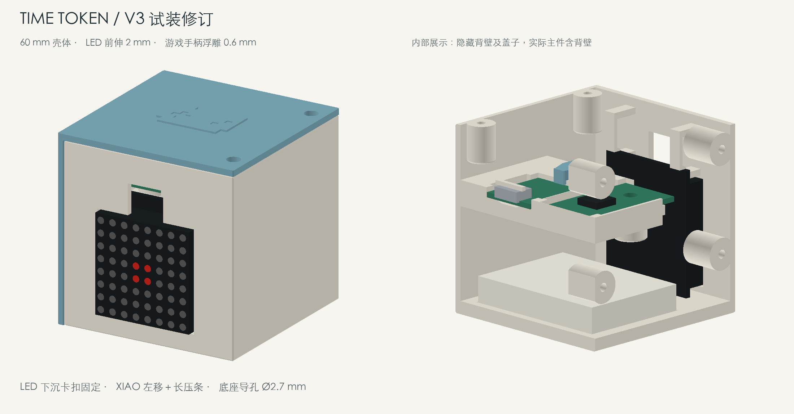

Figure 11. Revision with lowered LED, shallow base slot, and upper retainer.

### 8.3  Physical Iteration Three  Replacing the LED Kit and Redesigning Front Retention

The third round adopted a three-pack of MAX7219 8 × 8 LED modules. The new module has a driver approximately the same size as the LED face, places the input connector on the back, and provides fixed red, green, and blue versions. This removed the previous top connector from the cover space. The enclosure was changed to wrap around all four edges of the front panel, allowing the module to be secured by pushing it outwards from inside. Physical fitting showed that this was firm enough without screws or complex clips in the limited space. The controller also changed from the XIAO SAMD21 to the ESP32-S3-Zero, so the USB-C opening and retaining bar were updated.

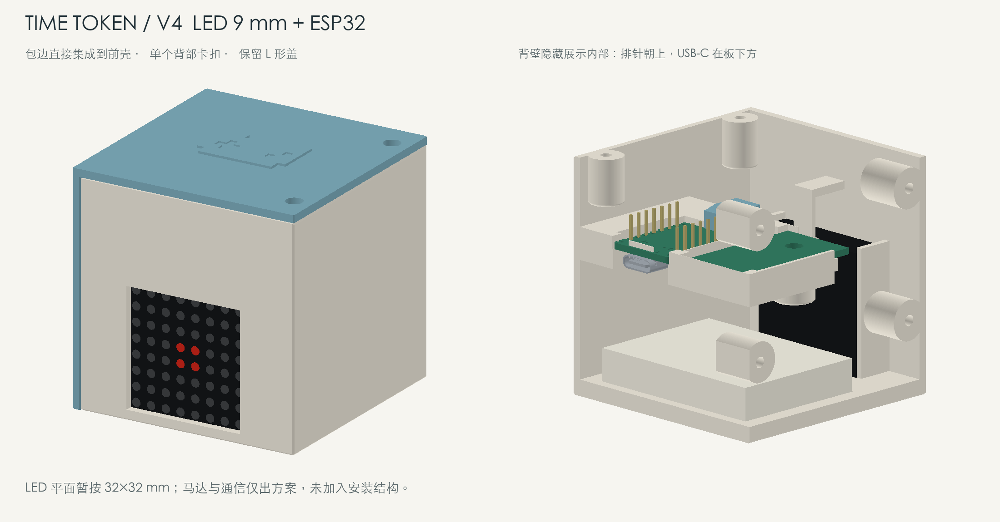

Figure 12. Structural rearrangement for the new LED module and ESP32-S3-Zero.

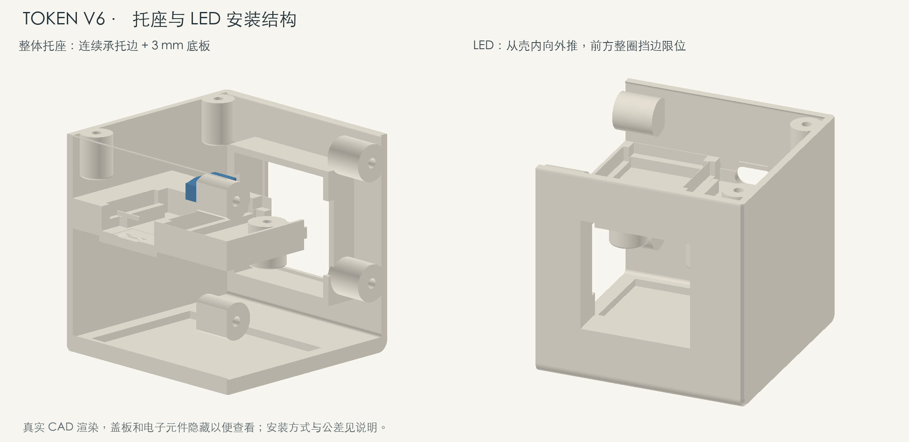

Figure 13. Tray, supports, and USB-C opening reinforced after print testing.

#### Physical evidence from iteration three

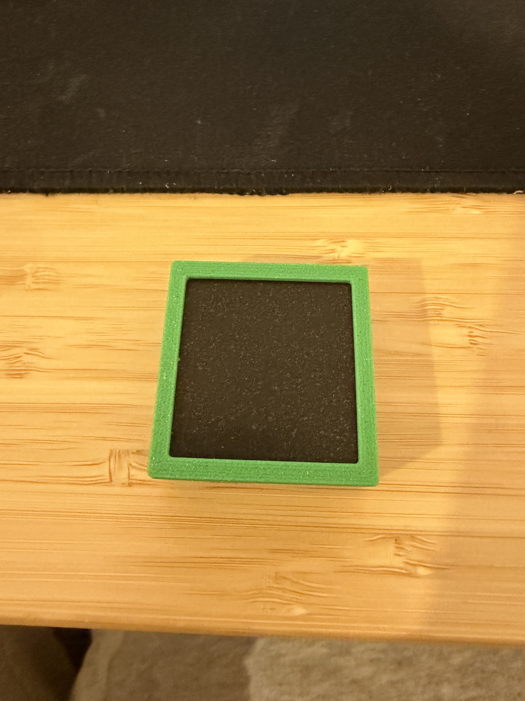

Figure 14. Front view of the black LED panel fitted into the printed frame.

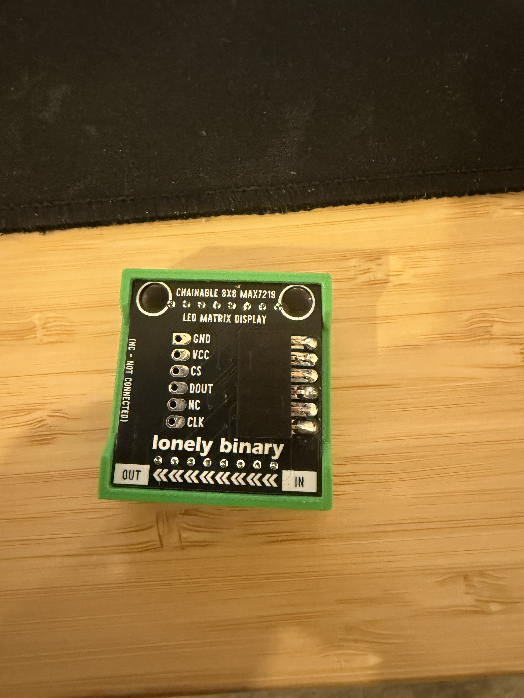

Figure 15. Rear driver and the retained PCB edges.

### 8.4  Physical Iteration Four  Final Exterior and Internal Assembly

The fourth round combined the exterior and internal mounting system into the final course prototype. The four vertical edges use an approximately R5 corner radius, while the top and bottom remain flat to prevent large curves from creating rough unsupported surfaces during printing. Three raised-symbol lids represent study, entertainment, and rest. The sensor base was made thinner and supported by three cross ribs, with the screw-hole centre positioned 22 mm from the rear inner wall. The ESP32 platform was lowered by 2 mm, and the vibration-module rail was moved below it. The bottom profile was checked for interference with the recess at the top of the Tower.

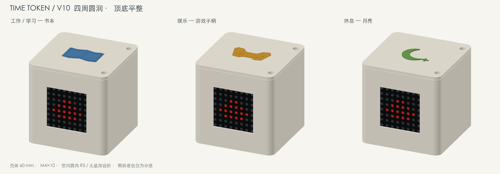

Figure 16. Final three lids with rounded vertical edges and flat top and bottom surfaces.

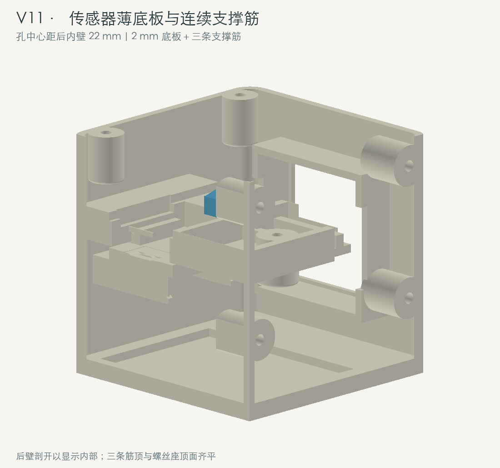

Figure 17. Final sensor support ribs and continuous internal support surface.

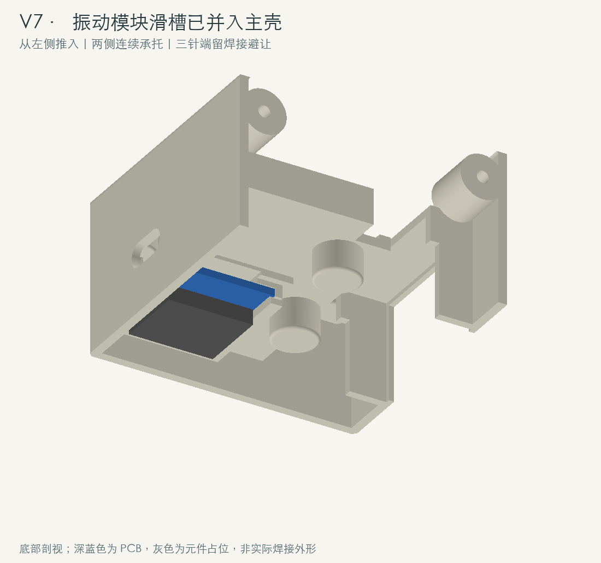

Figure 18. Screwless rail that allows the vibration module to slide directly into the main shell.

The final version includes printable STEP and STL files and an editable Shapr3D file. Geometry, mesh, and offline slicing checks have also been completed. The current record does not include photographs of the fully assembled final prototype, so this document leaves dedicated photo spaces instead of using renders as physical evidence.

## 9  Time Tower Structural Development

### 9.1  Three-Part Tower Body

Time Tower measures about 115 × 110 × 400 mm. To fit the Bambu Lab A1 build volume of 256 × 256 × 256 mm, the body is printed as three parts: a lower section, upper section, and top cap. The lower section holds the PB200. The upper section holds two control boards and supports the LED panel. The top cap provides a 62 × 62 mm Token recess about 4 mm deep. Both joints use three locking tabs and approximately 15° of rotation, so each part is inserted first and then twisted into position.

Figure 19. Three printed Time Tower parts and the continuous LED panel.

### 9.2  LED Rails and Wiring

The flexible LED panel remains flat rather than being rolled into a cylinder. The left and right rails hold only the approximately 3 mm blank edges of the panel, leaving the centre of the window open. The original plan used a backing plate behind the rails with a cable opening. The printed upper section did not include a complete rear stop, so one rail slot could not control the panel securely. A locating slot about 2 mm deep was therefore added to the lower section, together with a separate upper retainer. The retainer is inserted from the top and extends down about 50 mm. It uses the left and right inner walls, the tops of the rails, and a C-shaped clip on the right to hold the panel mechanically.

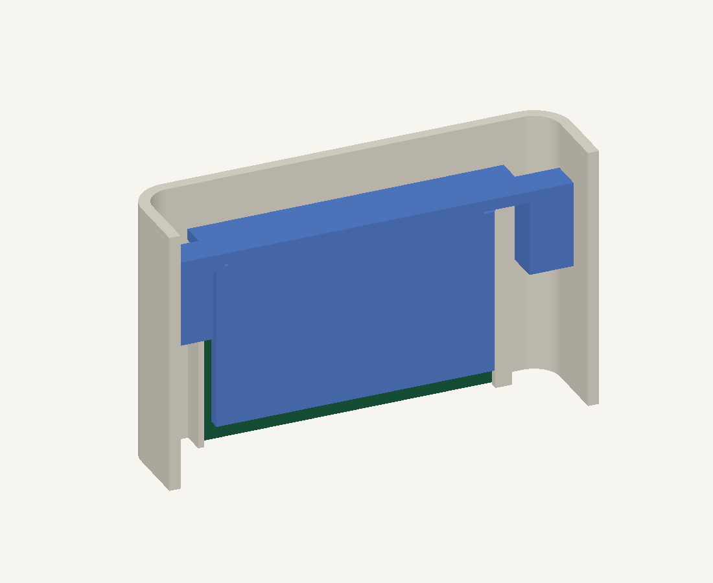

Figure 20. Upper retainer restricting the LED panel edge from the rear.

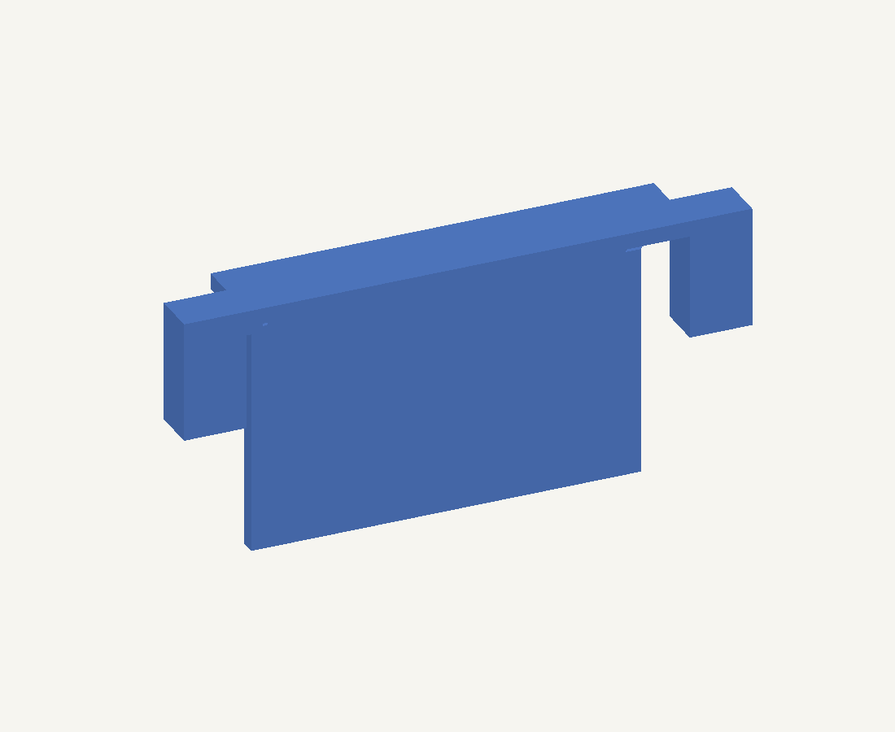

Figure 21. Locating wings, top bridge, rear stop, and right-side C-shaped clip.

### 9.3  Structural Problems Identified

- The left and right sides of the printed upper connection ring did not fully join the main body. The existing part relies mainly on its rear connection and needs reinforcement through the lower fit and additional part.

- The upper edge of the LED panel needs an additional retainer because the existing rails cannot control front-to-back movement by themselves.

- The twist-lock tabs passed CAD interference checks at selected positions, but printed tolerance, assembly feel, and long-term resistance to loosening still require physical testing.

- Final photographs of the complete Tower and the Token insertion fit still need to be added.

## 10  Completed Development Outputs

The project has produced more than an exterior model. It now includes prototype development records covering purchasing, electronic testing, enclosure design, print corrections, and integration with Time Tower. The following material can be used directly as evidence of individual contribution to the course project.

| Output | Details | Evidence location |
| --- | --- | --- |
| Prototype quotation | Core components, optional power, and budget boundaries for three Tokens and one shared device | LED互动装置原型报价单.xlsx |
| Time Token CAD | Main shell, three lids, ESP32 retaining bar, sensor support, and vibration-module rail | outputs/v2 to v11; STEP, STL, and Shapr3D |
| Physical fitting record | Initial electronic prototype, new LED module frame, and photographs of print issues | outputs/reference_photos and work/token_v6_photos |
| Print verification | Closed-mesh checks, geometry interference checks, A1 offline slicing, and fit checks | geometry_check, slice_review, and fit_check for each version |
| Time Tower CAD | Lower section, upper section, top cap, twist-lock test pieces, electronics layout, and LED rails | outputs/time_tower_v1 |
| Tower LED reinforcement part | 50 mm rear stop, left and right locating wings, and right-side C-shaped clip | outputs/led_top_retainer_v1 |
| Test firmware | Accelerometer diagnostics, MAX7219 tests, eight-second animation, and vibration GPIO tests | firmware directory |

### 10.1  How This Contribution Can Be Described

I was responsible for turning the selected interaction concept into a physical system that could be purchased, wired, programmed, modelled, and printed. I prepared the prototype quotation and component requirements, revised the Time Token enclosure in response to real components and print results, and completed mounting structures for the LED, accelerometer, ESP32, and vibration module. I also designed the three-part Time Tower body, LED rails, Token recess, and later reinforcement part. I did not count every CAD change as a completed iteration. The development evidence is organised around four rounds of physical making and fitting.

The current prototype shows that the main electronic components can be organised inside a 60 mm Token and provides a complete structural direction for its connection with the Tower. Orientation sensing and the LED module have been tested separately. The vibration module, wireless communication between the Token and Tower, and the final physical assembly of the complete Tower still require verification.

### 10.2  Final Physical Photographs

The following spaces are reserved for final physical evidence. Once the photographs are available, they should replace the placeholders and each caption should state what is shown and what was verified.

[TO ADD]

Final physical photograph of the Time Token front

[TO ADD]

Final physical photograph of the Time Token internal assembly

[TO ADD]

Photograph of the vibration-module rail and wiring detail

[TO ADD]

Photograph of the Time Token inserted into the top of Time Tower

### 10.3  Main References and Purchase Records

| Item | Record |
| --- | --- |
| MAX7219 LED three-pack | Amazon Australia  B0GYRTNQZ3 |
| MMA8452Q accelerometer | Keyestudio KS0270 product and tutorial page |
| Vibration module | Amazon Australia  B0H7WZ1L44; 3.0–5.3 V, rated at 60 mA |
| WS2812B 8 × 32 panel | User-provided specification: 316 × 80 × 2 mm |
| Power bank | CUKTECH 15  PB200  20,000 mAh |
| 3D printer | Bambu Lab A1  256 × 256 × 256 mm build volume |

## Deployment and Testing

- [Deployment instructions](deployment/README.md)
- [Tests and evaluation evidence](tests/README.md)
